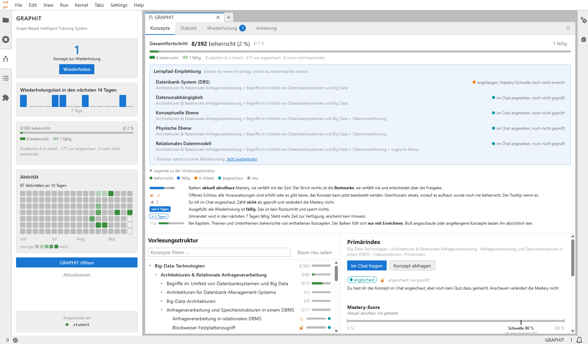

# GRAPHIT — Graph-Based Intelligent Tutoring System

GRAPHIT is an intelligent tutoring system for university lectures. It models a lecture as a
**knowledge graph** in Neo4j (chapters, topics, concepts, slides and the prerequisite
relations between concepts) and builds three learning functions on top of it:

- a **multi-agent tutor chat** that explains concepts strictly from the lecture slides and
  advises on the learning path,
- **automatically generated, validated quizzes** with deterministic grading, and
- a **learner model** with time decay that tracks mastery per concept, schedules reviews and
  unlocks follow-up concepts.

Students use GRAPHIT inside **JupyterLab** through the `graphit-jupyter` extension; a
**JupyterHub** gives every student an own, preconfigured environment. The whole stack runs
with Docker Compose. This repository contains the backend, the deployment and a prebuilt
wheel of the extension; the extension's source code lives in
[GRAPHIT-Frontend](https://github.com/Barbarossa2711/GRAPHIT-Frontend).

> GRAPHIT was built for the master's lecture *Big Data Technologies*. The user interface,
> the agent prompts and the generated questions are in **German**; the code and this
> documentation are in English. Lecture content is **not** part of this repository, see
> [Data](#data).

<!-- SCREENSHOT: overview of the JupyterLab workspace with the GRAPHIT sidebar and chat

-->

---

## Contents

- [Features](#features)
- [Screenshots](#screenshots)
- [Architecture](#architecture)
- [How it works](#how-it-works)
- [Repository structure](#repository-structure)
- [Installation](#installation)
- [Data](#data)
- [Configuration](#configuration)
- [REST API](#rest-api)
- [Command line tools](#command-line-tools)
- [Security notes](#security-notes)
- [License](#license)

---

## Features

### For students

| Feature | Description |
|---|---|
| **Domain tree** | The lecture as an expandable tree (lecture › chapter › topic › subtopic › concept) with filter and keyboard navigation. Every node shows the learning state as a badge. |
| **Tutor chat** | Explains concepts in natural language, grounded exclusively in the lecture slides. Every answer lists the slides it is based on (chapter, page, slide set version). |
| **Scoped chat** | The chat can be bound to the topic selected in the tree. Questions outside that topic are not answered; instead the tutor points to the right place with a clickable link to the concept. |
| **Learning path advisor** | Answers "What should I learn next?" and "What do I need for X?" from the prerequisite graph and the learner's state, including optional helpful ("facilitator") concepts. |
| **Learning path recommendation** | Shows the concepts that can be learned now, the ones still blocked with their missing prerequisites, and the ones due for review. |
| **Quizzes** | Five question types: single choice, multiple choice, cloze, matching and ordering. A concept can be tested on its own ("test concept"), a chapter or topic as a combined quiz. Feedback shows the solution per question type. |
| **Reviews** | Concepts whose mastery has decayed below the threshold become due. Due concepts can be selected and worked through as one combined review quiz. |
| **Statistics** | Progress per chapter, mastery distribution, review load for the next 14 days and an activity heatmap. |
| **Onboarding** | A guided tour and a built-in manual explaining mastery, statuses and the learning path. |

### Under the hood

| Feature | Description |
|---|---|
| **Multi-agent architecture** | A LangGraph supervisor delegates to a *tutor agent* (explanations) and a *recommender agent* (learning path). The split is invisible to the student. |
| **Grounded answers** | The tutor may only use the slide texts returned by its tools; slide citations are collected server side and never sent back to the model. |
| **Real token streaming** | Answers are streamed as OpenAI-compatible SSE. A streaming filter removes broken link fragments and tool-call preambles while the text is still being written. |
| **Learner model** | Performance Factor Analysis (PFA) with exponential time decay; separates the decaying *retrieval strength* (review scheduling) from the monotonic *storage strength* (prerequisite gate). |
| **Question generation** | A three-phase LLM pipeline plans testable facts from the slides, generates schema-valid variants per question type, runs semantic checks with automatic correction, and fills an item budget derived from the learner model. |
| **Deterministic grading** | Answers are graded by comparing ids against the stored solution, without an LLM. |
| **Concept isolation** | Concepts that share slides are linked (`:CO_OCCURS`); questions that also test a neighbouring concept are annotated (`:REQUIRES`) and withheld until the student knows that neighbour. |
| **OpenAI-compatible endpoint** | The backend exposes `/v1/chat/completions` and works with any OpenAI-compatible LLM endpoint (OpenAI, OpenWebUI, vLLM, …). |
| **Multi-user deployment** | JupyterHub with DockerSpawner and NativeAuthenticator: one container per student, admin approval for new accounts, the student id is seeded from the JupyterHub login. |

---

## Screenshots

<!-- Add the screenshots to docs/screenshots/ and remove the comment markers below. -->

<!--
| | |
|---|---|
|  |  |
| *Domain tree with learning state* | *Tutor chat with slide citations* |
|  |  |
| *Quiz* | *Feedback per question type* |
|  |  |
| *Learning path recommendation* | *Statistics* |
|  |  |
| *Review of due concepts* | *Guided tour* |
-->

---

## Architecture

```
Browser ──── :8000 ───▶ JupyterHub ──spawn──▶ Single-user container (JupyterLab + graphit-jupyter)
   │
   └──────── :8077 ───▶ Backend (FastAPI) ──bolt──▶ Neo4j
            (the extension's JavaScript runs in the browser)
                              │
                              └──HTTPS──▶ OpenAI-compatible LLM endpoint
```

The extension's JavaScript runs in the student's **browser**, not in the container. The
backend URL configured for the extension (`GRAPHIT_BASE_URL`) is therefore the published
host port, not the Compose service name.

### Backend components

| Package | Responsibility |
|---|---|
| `Multiagent/server` | FastAPI app and the OpenAI-compatible chat adapter (run, stream, filter, cite). |
| `Multiagent/agents` | Supervisor, tutor and recommender agents, their prompts and tools. |
| `Multiagent/GraphAccess` | Graph schema, concept and slide access, domain tree, `:CO_OCCURS` derivation, slide JSON alignment. |
| `Multiagent/LearnerModel` | Learner subgraph (`:Student`, `:LEARNS`), visit counter, activity history, progress roll-ups. |
| `Multiagent/Assessment` | Mastery model (PFA with time decay) and deterministic grading. |
| `Multiagent/Recommender` | Deterministic learning path recommendation from prerequisites and learning state. |
| `Multiagent/QuestionGenerator` | LLM question generation pipeline, JSON schema, semantic and quality checks. |
| `Multiagent/QuestionStore` | Persistence of generated questions and their `:REQUIRES` annotation. |
| `Multiagent/Quiz` | Quiz service: load or generate, select, gate, shuffle, grade, update mastery. |
| `Multiagent/BDT2026_data` | Offline builder for the slide content JSON from lecture PDFs. |
| `Multiagent/llm_endpoint.py` | Shared factory for the LLM client (custom endpoint, TLS pinning, gateway fixes). |

### Docker services

| Service | Image | Purpose |
|---|---|---|
| `neo4j` | `neo4j:2026.07` | Knowledge graph and learner state. Writes a dump automatically on every orderly shutdown. |
| `backend` | `graphit-backend` | FastAPI server on port 8077 (bound to `127.0.0.1`). |
| `jupyterhub` | `graphit-jupyterhub` | Login and spawning of the per-student containers on port 8000. |
| `singleuser` | `graphit-singleuser` | Build-only: JupyterLab image with the `graphit-jupyter` extension. |

---

## How it works

### Knowledge graph

```
(:Lecture)-[:HAS_CHAPTER]->(:Chapter)-[:HAS_TOPIC]->(:Topic)-[:HAS_SUBTOPIC]->(:Subtopic)-[:HAS_CONCEPT]->(:Concept)
(:Slide)-[:COVERS]->(:Concept)
(:Concept)-[:PREREQUISITE]->(:Concept)      (A)->(B): B is required before A
(:Concept)-[:FACILITATOR]->(:Concept)       (A)->(B): B is helpful, but optional, for A
(:Concept)-[:SAME_AS]-(:Concept)            the same concept in another chapter
(:Question)-[:TESTS]->(:Concept)            curated lecture questions (optional)

-- created by GRAPHIT --
(:Concept)<-[:TESTS]-(:QuestionStem)-[:HAS_VARIANT]->(:GeneratedQuestion)
(:Concept)-[:CO_OCCURS {slides}]-(:Concept) concepts treated on the same slides
(:GeneratedQuestion)-[:REQUIRES]->(:Concept) neighbour concept a question also tests
(:Student)-[:LEARNS]->(:Concept)            learning state per student and concept
```

A `:QuestionStem` is one testable fact (knowledge component); its `:GeneratedQuestion`
variants ask the same fact in different formats and all update the same mastery estimate.
Slide *texts* are not stored in the graph but joined from the slide content JSON via
`(source, pageNumber)`.

### Chat

1. The frontend sends the full chat history to `/v1/chat/completions`, optionally with the
   selected topic (`scope`) and a `session_id`.
2. The **supervisor** delegates to the **tutor agent** (explanations) or the
   **recommender agent** (learning path).
3. The tutor resolves the concept with `find_concept` and loads the slides with
   `get_concept_material`, the only allowed knowledge source. The recommender calls
   `next_steps` (open question) or `recommend_next` (question with a target concept).
4. The server streams only the agent's answer, removes broken `[[…]]` link fragments,
   appends a pointer to the right place if the question lies outside the selected topic,
   records a visit for the concepts covered, and attaches the slide citations to the final
   chunk (`graphit_slides`).

Chatting never changes mastery; it only increments a session-based visit counter.

### Learner model

Per student and concept GRAPHIT stores the cumulative correct answers `s`, wrong answers `f`
and the day of the last attempt `t_last`. Mastery is computed on read:

```
λ       = ln(2) / t_h
s_eff   = s · exp(−λ · (t_now − t_last))
m       = γ · s_eff + ρ · f
P       = 1 / (1 + exp(−m))
mastery = max(0, (P − 0.5) · 2)
```

with half-life `t_h = 28` days, `γ = 0.75`, `ρ = −0.30` and the threshold `0.8`. A concept
needs at least three correct answers to reach the threshold.

Two quantities serve two purposes:

- the **current mastery** decays over time and decides when a **review is due**;
- the **peak mastery** (`mastery_peak`) never decays and decides the **prerequisite gate**:
  once a concept was mastered, it unlocks its follow-up concepts permanently.

| Status | Meaning |
|---|---|
| `new` | never visited |
| `visited` | explained in the chat, never tested |
| `in_progress` | tested, threshold not reached yet; blocks follow-up concepts |
| `due_review` | threshold reached once, current mastery dropped; review due, blocks nothing |
| `mastered` | threshold reached and current |

### Quiz

1. `/quiz/candidates` resolves a concept, topic or chapter into testable concepts and lists
   the concepts sharing slides with them.
2. `/quiz/start` loads the concept's stored questions. Only if none exist, or the stored set
   misses the item budget, the question generator runs. Questions that also test a
   neighbour concept the student does not know yet are withheld. Items are selected
   round-robin over stems (never asked first), the presented option order is shuffled, and
   the solutions are removed before the questions are sent.
3. `/quiz/submit` grades every answer deterministically, updates `s`, `f`, `t_last` and
   `mastery_peak`, and returns the solutions for the feedback view.

### Question generation

For every concept the generator receives the slide texts, existing lecture questions and
the neighbour concepts it must not test.

1. **Plan**: the LLM plans the testable facts (stems) and suitable question types; the
   number of stems is derived from the slide count. Each curated lecture question becomes a
   stem of its own.
2. **Generate**: one variant per stem and question type via structured output. Each variant
   is validated against [`question_schema.json`](Multiagent/QuestionGenerator/question_schema.json)
   and semantic checks (solvable solution, unique option texts, distractors present, no
   internal ids in visible text, …). Errors are fed back to the LLM for up to three attempts.
3. **Fill the item budget**: isomorphic variants of existing stems are added until the
   concept has enough distinct items to reach the mastery threshold without repeating a
   question.

Non-blocking quality warnings (e.g. the correct option being much longer than the
distractors) are logged per item.

---

## Repository structure

```
.
├── Multiagent/                  backend (Python package)
│   ├── server/                  FastAPI app, OpenAI-compatible chat adapter
│   ├── agents/                  supervisor, agents, prompts, tools
│   ├── GraphAccess/             graph schema and access, domain tree, data tools
│   ├── LearnerModel/            learner subgraph, progress
│   ├── Assessment/              mastery model, grading
│   ├── Recommender/             learning path recommendation
│   ├── QuestionGenerator/       question generation pipeline and JSON schema
│   ├── QuestionStore/           question persistence and :REQUIRES annotation
│   ├── Quiz/                    quiz service
│   ├── BDT2026_data/            slide JSON builder (place your slide JSON here)
│   ├── generate_questions.py    batch question generation
│   ├── repair_questions.py      regenerate flagged questions
│   ├── run_demo.py              one chat turn without server and frontend
│   └── .env.example
├── Docker/
│   ├── docker-compose.yml
│   ├── .env.example
│   ├── backend/                 backend image
│   ├── jupyterhub/              hub image and configuration
│   ├── singleuser/              JupyterLab image with the extension
│   ├── neo4j/                   dump-on-shutdown entrypoint, dumps/
│   ├── GRAPHIT_Frontend_extension/  prebuilt graphit-jupyter wheel
│   └── certs/                   optional CA certificate of the LLM endpoint
├── docs/screenshots/
└── requirements.txt
```

---

## Installation

### Prerequisites

- Docker with Docker Compose v2
- An OpenAI-compatible LLM endpoint with tool calling (or an OpenAI API key)
- Your lecture data: a Neo4j dump of the knowledge graph and the slide content JSON
  (see [Data](#data))

### Docker (recommended)

Run all commands from the `Docker/` directory so that Compose picks up `Docker/.env`.

**1. Configure**

```bash
cd Docker
cp .env.example .env
```

Fill in at least `NEO4J_PASSWORD` and the LLM endpoint (`LLM_BASE_URL`, `LLM_API_KEY`,
`LLM_MODEL`) or `OPENAI_API_KEY`. If the endpoint uses a self-signed certificate, copy it to
`Docker/certs/` and set `LLM_CA_BUNDLE=/etc/graphit/certs/<file>`.

**2. Add the slide content JSON**

Copy your slide JSON to `Multiagent/BDT2026_data/BDT26-chunks-from-pdf.json` (the default
path; it is baked into the backend image).

**3. Build the images**

```bash
docker compose --profile build build
```

The single-user build fails on purpose if the extension is not registered or its bundle is
incomplete.

**4. Load the knowledge graph**

Put your dump at `Docker/neo4j/dumps/neo4j.dump` (the file name determines the database
name), then:

```bash
docker compose up -d neo4j        # wait until "docker compose ps" shows (healthy)
docker compose stop neo4j         # loading requires a stopped server

docker compose run --rm --entrypoint neo4j-admin neo4j \
  database load neo4j --from-path=/dumps --overwrite-destination=true
```

In Git Bash on Windows prefix the command with `MSYS_NO_PATHCONV=1`. Neo4j Community can
only load dumps in the standard/aligned store format; a block-format dump (e.g. from Neo4j
Desktop) has to be converted with an Enterprise `neo4j-admin database copy --to-format=aligned`
first.

**5. Start and derive the helper edges**

```bash
docker compose up -d
docker compose exec backend python -m Multiagent.GraphAccess.co_occurrence
docker compose exec backend python -m Multiagent.QuestionStore.question_scope
```

`co_occurrence` creates the `:CO_OCCURS` edges and must run after every rebuild of the
graph; without them the isolation of neighbour concepts silently does nothing.
`question_scope` annotates already stored generated questions (new ones are annotated
automatically).

**6. Check**

```bash
curl http://localhost:8077/v1/models      # -> graphit-tutor
curl http://localhost:8077/domain/tree    # -> non-empty tree
```

**7. Create the admin account**

Open <http://localhost:8000>, sign up with the name set in `JUPYTERHUB_ADMIN` (default
`admin`); this account is authorized automatically. Students sign up themselves and are
approved at <http://localhost:8000/hub/authorize>. After login, the GRAPHIT icon in the
JupyterLab sidebar opens the extension.

**Optional: pre-generate questions**

Generating questions on the first quiz start takes a while. To generate them in advance:

```bash
docker compose exec backend python -m Multiagent.generate_questions --all --dry-run
docker compose exec backend python -m Multiagent.generate_questions --all --keep-going
```

### Local development

```bash
python -m venv .venv
source .venv/bin/activate            # Windows: .venv\Scripts\activate
pip install -r requirements.txt

cp Multiagent/.env.example Multiagent/.env   # fill in Neo4j and LLM settings
cd Docker && docker compose up -d neo4j && cd ..

uvicorn Multiagent.server.app:app --port 8077 --workers 1
```

Always use exactly one worker: running quizzes are cached in process memory, so
`/quiz/submit` would fail with 404 in another worker.

To use the extension with a local `jupyter lab`, install the wheel into the JupyterLab
environment and set the student id once via the command palette
(*GRAPHIT: Studenten-ID festlegen …*). A local JupyterLab on port 8888 is allowed by the default CORS
origins; other origins are set with `GRAPHIT_CORS_ORIGINS`.

To try the agents without server and frontend:

```bash
python -m Multiagent.run_demo "Erkläre mir Sharding."
```

---

## Data

The repository contains no lecture material. To run GRAPHIT for a lecture you need two
things.

### 1. Knowledge graph (Neo4j)

The graph must follow the schema in [Knowledge graph](#knowledge-graph). Required
properties:

| Label | Properties |
|---|---|
| `:Lecture` | `id`, `name` |
| `:Chapter` | `id`, `name`, `index` |
| `:Topic`, `:Subtopic` | `id`, `name` |
| `:Concept` | `id`, `name`, optional `objective` |
| `:Slide` | `source` (file name of the slide set), `pageNumber` |
| `:Question` (optional) | `text`, `index` |

Concept ids should be hierarchical (e.g. `BDT_CH01_T03_S02_C02`): siblings and learning path
suggestions are sorted by id, so their lexicographic order should be the curriculum order.
The path from chapter to concept may have a depth of two to five levels. Label and property
names can be adapted centrally in `GraphSchema` (`Multiagent/GraphAccess/config.py`).

### 2. Slide content JSON

A JSON list with one entry per slide:

```json
[
  {
    "title": "Sharding",
    "content": "Sharding distributes data across several nodes …",
    "metadata": {
      "type": "slide",
      "source": "02-NoSQL.pdf",
      "slide_number": 17,
      "chapter": "NoSQL",
      "chapter_num": 2,
      "image_description": "optional description of a figure on the slide"
    }
  }
]
```

Entries are joined with the graph's `:Slide` nodes via the file stem of `source` and
`slide_number == pageNumber` (the extension is ignored). Only entries with
`metadata.type == "slide"` are used. The text passed to the tutor is title, content and
image description combined.

`python -m Multiagent.BDT2026_data.build_chunks` builds this file from the lecture PDFs in
`BDT_Folien/` (one entry per page) and lets a vision model describe slides with figures.
`python -m Multiagent.GraphAccess.align_slide_json` aligns an existing JSON with the graph's
page numbers.

---

## Configuration

Settings are read from `Multiagent/.env` (local) or `Docker/.env` (Compose). See the two
`.env.example` files for all options.

| Variable | Purpose |
|---|---|
| `LLM_BASE_URL`, `LLM_API_KEY`, `LLM_MODEL` | OpenAI-compatible endpoint for chat and question generation. Empty base URL: api.openai.com. |
| `LLM_STRUCTURED_METHOD` | `function_calling` (default), `json_schema` or `json_mode`. |
| `LLM_CA_BUNDLE` | CA certificate for an endpoint with a self-signed certificate. |
| `LLM_VERIFY_SSL` | `false` disables TLS verification (emergency fallback only). |
| `OPENAI_API_KEY`, `SUPERVISOR_USE_OPENAI` | OpenAI key; `true` routes the chat to api.openai.com (`gpt-4o`). |
| `NEO4J_URI`, `NEO4J_USER`, `NEO4J_PASSWORD`, `NEO4J_DATABASE` | Neo4j connection (set by Compose except the password). |
| `SLIDE_CONTENT_JSON` | Path of the slide content JSON. |
| `FOLIEN_STAND` | Version label of the slide set shown in the citations. |
| `CHAT_STREAM_SIMULIERT` | `true` computes the full answer first and streams it word by word. |
| `GRAPHIT_CORS_ORIGINS` | Allowed browser origins (comma-separated). |
| `LANGSMITH_TRACING`, `LANGSMITH_API_KEY`, `LANGSMITH_PROJECT` | Optional LangSmith tracing. |
| `JUPYTERHUB_ADMIN` | Admin account(s) of the hub. |
| `GRAPHIT_BASE_URL` | Backend URL as seen by the browser. |
| `GRAPHIT_SHOW_DIAGNOSTICS`, `GRAPHIT_MOCK_MODE`, `GRAPHIT_STREAMING`, `GRAPHIT_CHAT_MODEL`, `GRAPHIT_REVIEW_SESSION_SIZE`, `GRAPHIT_PERSIST_CHAT_HISTORY` | Extension settings, seeded into every student container. |
| `GRAPHIT_DUMP_AUS`, `GRAPHIT_DUMP_BEHALTEN` | Disable the dump on shutdown / number of dumps kept. |

---

## REST API

All user-specific endpoints identify the student by the header `X-Student-Id` (or the
`student_id`/`user` field). Requests without an id are rejected.

| Method | Endpoint | Description |
|---|---|---|
| `GET` | `/v1/models` | Model list for OpenAI clients (`graphit-tutor`); also the health check. |
| `POST` | `/v1/chat/completions` | OpenAI-compatible chat, optionally streamed (SSE). Extra fields: `scope` `{id, name, type}`, `session_id`. Slide citations in `graphit_slides`. |
| `GET` | `/domain/tree` | Lecture hierarchy as a nested tree. |
| `GET` | `/progress` | Learning state of all concepts plus roll-ups per hierarchy node. |
| `GET` | `/activity` | Activity days for the heatmap. |
| `GET` | `/recommend?concept_id=…` | Learning path to a target concept. |
| `GET` | `/next?limit=…` | Concepts to work on next across the whole lecture. |
| `POST` | `/quiz/candidates` | Resolves `concept_id` / `topic_id` into testable concepts and their slide-sharing neighbours. |
| `POST` | `/quiz/start` | Starts a quiz run for `concept_id`; returns the questions without solutions. |
| `POST` | `/quiz/submit` | Grades `answers` (`question_id -> answer`) for a `quiz_id` and updates mastery. |

Interactive documentation is available at `http://localhost:8077/docs`.

---

## Command line tools

All tools run from the repository root (or inside the backend container) with
`python -m <module>`; `--help` lists all options.

| Module | Purpose |
|---|---|
| `Multiagent.generate_questions` | Generates questions for `--chapter`, `--concept` or `--all` concepts with progress bars; `--dry-run` estimates items and time. `--refresh` replaces stored sets and requires `--i-know-what-i-am-doing`. |
| `Multiagent.repair_questions` | Regenerates stored items that fail the current checks, after writing a backup. |
| `Multiagent.GraphAccess.co_occurrence` | Derives the `:CO_OCCURS` edges from shared slides. |
| `Multiagent.QuestionStore.question_scope` | Annotates generated questions with the neighbour concepts they also test (`:REQUIRES`). |
| `Multiagent.GraphAccess` | Loads a concept and its slides (`--describe` prints raw properties, `--generate` runs the generator). |
| `Multiagent.GraphAccess.align_slide_json` | Aligns the slide JSON with the graph's page numbers. |
| `Multiagent.BDT2026_data.build_chunks` | Builds the slide JSON from lecture PDFs. |
| `Multiagent.QuestionGenerator.example` | Runs the question generator on a built-in example concept. |
| `Multiagent.Assessment.mastery` | Prints the due intervals of the mastery model. |
| `Multiagent.run_demo` | One chat turn through the agents, printed to the console. |

---

## Security notes

- The backend has **no authentication of its own**; it trusts `X-Student-Id`. It is
  therefore bound to `127.0.0.1` in Compose, and the student id is seeded from the
  JupyterHub login and hidden from the settings editor.
- JupyterHub uses NativeAuthenticator without open sign-up: every new account has to be
  approved by an admin.
- Secrets belong in the `.env` files, which are git-ignored and excluded from the backend
  image.
- The chat endpoint logs metadata only, never message content.

---

## License

The license has not been chosen yet.
